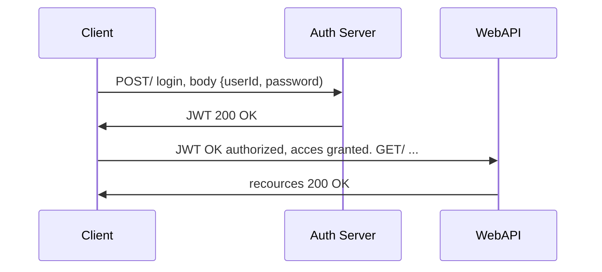

# Squeak
The app in production may be found at: https://squeak-frontend.herokuapp.com/

This is the front-end part of the squeak app. The database and server can be found at: https://github.com/elovisae/Squeak_backend

Squeak is a social media platform where you can publish messages for everyone to read. Think twitter - but SQUEAKIER.

## Table of content
* [TTHFW](#TFFHW)
* [Technologies](#Technologies:)
* [Scripts](#Scripts)
* [Authentification Flow](#authentification-flow)

## TTFHW

Start with cloning the repository by copying this code in to your terminal.

For **npm** : 

``` bash
cd ws
git clone https://github.com/JesperHagman/Squeak
npm install
```
For **yarn** :

``` bash
cd ws
git clone https://github.com/JesperHagman/Squeak
yarn install
``` 

To run the project, open your terminal and type **npm start** or **yarn start**.

Open [http://localhost:3000](http://localhost:3000) to see the project in your browser.

## Testing

Squeak uses two different testing frameworks, **Jest** and **Cypress**.

To run **Jest**:

``` bash
npm test
```

To run **Cypress**:

``` bash
npm run e2e
```
or, if you only want to run in the terminal:

``` bash
npm run component
```

## Technologies:
**Heroku** pipelines will be used for CI/CD and the deployment of this app. The production stage of this app may be found at https://squeak-frontend.herokuapp.com/. 
For more information about heroku pipelines, visit [heroku's website](https://devcenter.heroku.com/articles/pipelines)

**MongoDB** is used as the database for this app. More information on the server may be found at https://github.com/elovisae/Squeak_backend and the server is deployed at https://squeak-backend.herokuapp.com/api-docs

**React** is the framework used when building this application. And **react-router-dom** is used for the navigation.

For testing, **jest** is used for unit-testing and **cypress** is used for component and integration testing.

### Dependencies:
- React
- React-dom
- React-router-dom
- React scripts
- Axios
- Save-dev
- Styled components
- Web vitals

### Dev dependencies
- Babel-jest
- Cypress
- Eslint
- Husky
- Identity-obj-proxy
- Jest
- Prettier
- React-test-renderer


## Scripts

**Start the local server**
```bash
	npm start
```

Go to localhost:3000

**Run jest tests**
```bash
	npm test
```

**Run cypress tests**
```bash
	npm run e2e	
```

or to run cypress in the terminal:

```bash
	npm run component
```


## Authentification Flow



