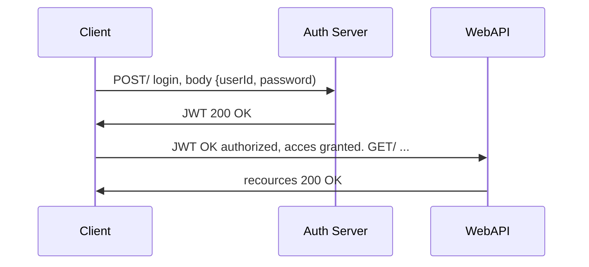

# Squeak
This is the front-end part of the squeak app. The database and server can be found at: https://github.com/elovisae/Squeak_backend

Squeak is a social media platform where you can publish messages for everyone to read. Think twitter - but SQUEAKIER.

## Table of content
* [TTHFW](#TFFHW)
* [Technologies](#Technologies:)
* [Packages](#Packages) 
* [Authentification Flow](#authentification-flow)

## TTFHW

Start with cloning the repository by copying this code in to your terminal.

For **npm** : 

``` bash
cd ws
git clone https://github.com/JesperHagman/Squeak
npm install
```
For **yarn** :

``` bash
cd ws
git clone https://github.com/JesperHagman/Squeak
yarn install
``` 

To run the project, open your terminal and type **npm start** or **yarn start**.

Open [http://localhost:3000](http://localhost:3000) to see the project in your browser.

## Testing

Squeak uses two different testing frameworks, **Jest** and **Cypress**.

To run **Jest**:

``` bash
npm test
```

To run **Cypress**:

``` bash
npm run e2e
```
or, if you only want to run in the terminal:

``` bash
npm run component
```

## Packages:
- React
- React-router-dom
- Axios
- Save-dev
- Eslint
- Express
- Mongoose
- Styled components
- Web vitals
- Jest
- Husky
- Cypress


## Authentification Flow



## Scripts


