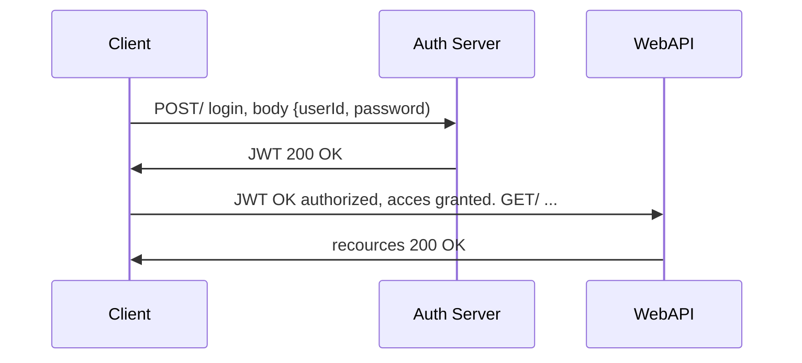

# Squeak

## TTFHW 

### Database developer

``` javascript
cd <your-workspace>
mkdir <directory-name>
cd <directory-name>
git clone https://github.com/JesperHagman/Squeak.git
npm install
touch .dev.env
code .
npm run start-dev
```

In the .dev.env file, add the following to connect the db:

``` javascript
REACT_APP_API_KEY               = XXXXXXXXXXXXXXXXXXXXXXXXXX
REACT_APP_AUTH_DOMAIN           = XXXXXX.firebaseapp.com
REACT_APP_PROJECT_ID            = XXXXXXXX
REACT_APP_STORAGE_BUCKET        = XXXXXXXX.appspot.com
REACT_APP_MESSAGING_SENDER_ID   = XXXXXXXX
REACT_APP_APP_ID                = XXXXX:web:XXXXXXXXX

```

## Authentification flow



## Scripts
There are different script start commands for different environments:

#### `npm run start-dev`
For the development stage


#### `npm run start-prod`


