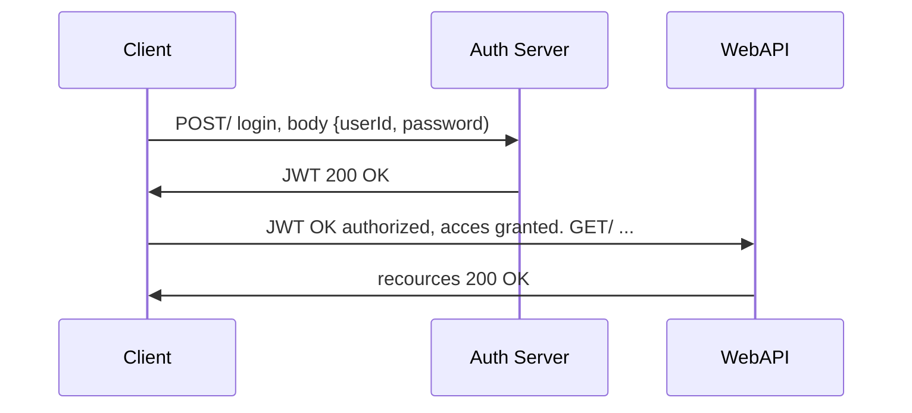

# Squeak
This is the front-end part of the squeak app. The database and server can be found at: https://github.com/elovisae/Squeak_backend

Squeak is s social media platform where you can publish messages for everyone to read. Think twitter - but SQUEAKIER.

## Table of content
* [TTHFW](#TFFHW)
* [Technologies](#Technologies:)
* [Authentification flow](#Authentification flow)
## TTFHW

## Packages:
- React
- React-router-dom
- Axios
- Save-dev
- Eslint
- Express
- Mongoose
- Styled components
- Web vitals
- Jest
- Husky
- Nodemon

## Authentification flow

## Scripts

