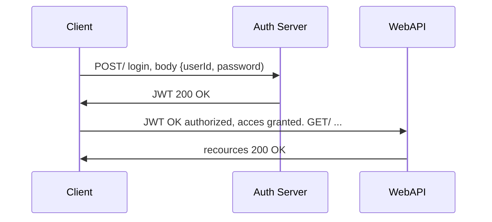

# Squeak


## Authentification flow


```mermaid
	sequenceDiagram
    		participant C as Client
    		participant S as Auth Server
		participant W as WebAPI 
    		C->>S: POST/ login, body {userId, password)
    		S->>C: JWT 200 OK
		C->>W: JWT OK authorized, acces granted. GET/ ...
		W->>C: recources 200 OK	
```

## Instruktion frontendutvecklare

```javascript
cd ~
cd ws
mkdir squeak
cd squeak
npm i
code .
npm start
```
